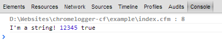
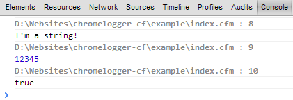
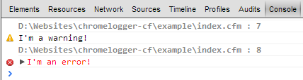
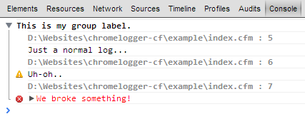
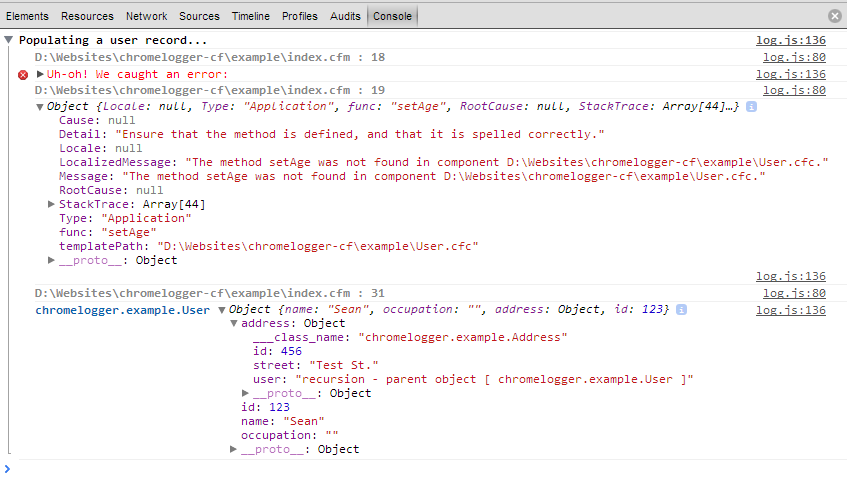

About two weeks ago, I spotted a link on either Reddit or Hacker News to a Google Chrome extension called [Chrome Logger](http://www.chromelogger.com/). I immediately saw the potential, because I frequently want to `cfdump` something but have to either abort immediately after or worry about my dump disappearing into a thread, screwing up my layout, etc., etc. There were libraries available for PHP, Python, and Ruby at the time (Node was added recently as well), so I figured I may as well jump on board and put one together for CF.

I finished my preliminary work on the component last weekend and used it at work all week, fixing bugs as I came across them. I'm now reasonably confident that it can be put into the wild, so I'm pleased to announce version 0.1 of chromelogger-cf, hosted at http://www.github.com/s992/chromelogger-cf

In addition to logging simple values, structs, arrays, and queries, I've also added a method to convert objects (primarily ORM entities) into a struct representation, including relationships.

<!-- more -->

In addition to logging simple values, structs, arrays, and queries, I've also added a method to convert objects (primarily ORM entities) into a struct representation, including relationships. I imagine this is where most of the bugs will surface, so please don't hesitate to open an issue if you run into some weirdness.

Ok, enough of the boring stuff - let's see how this thing actually works!

The most basic logging is accomplished via `chromelogger.log()`. Simply pass in any number of arguments and check the Chrome console.

```java
string = "I'm a string!";
numeric = 12345;
boolean = true;

chromelogger.log( string, numeric, boolean );
```

This results in the following output to the console:



Of course, if you don't want all your logged items on one line, you can call log() as many times as you want:

```java
string = "I'm a string!";
numeric = 12345;
boolean = true;

chromelogger.log( string );
chromelogger.log( numeric );
chromelogger.log( boolean );
```



In addition to `log()`, you also have the option to `warn()` and `error()`:

```java
warn = "I'm a warning!";
error = "I'm an error!";

chromelogger.warn( warn );
chromelogger.error( error );
```



Don't forget about objects and exceptions (note that the recursion between User and Address is caught and handled):

```java
chromelogger.group( "This is my group label." );
chromelogger.log( "Just a normal log..." );
chromelogger.warn( "Uh-oh.." );
chromelogger.error( "We broke something!" );
chromelogger.groupEnd();
```



Stucts, arrays, and queries are supported too:

```java
user = new User();
address = new Address();

chromelogger.group( "Populating a user record..." );
user.setID( 123 );
user.setName( "Sean" );

// Let's try to set a non-existent property and then log the error.
try {

  user.setAge( 26 );

} catch( Any e ) {

	chromelogger.error( "Uh-oh! We caught an error:" );
	chromelogger.log( e );

}

address.setID( 456 );
address.setStreet( "Test St." );

// How does it work with some recursion?
user.setAddress( address );
address.setUser( user );

// Just fine!
chromelogger.log( user );

chromelogger.groupEnd();
```



So, there you have it. Check out the project on GitHub for (a little) more documentation and to get started!
